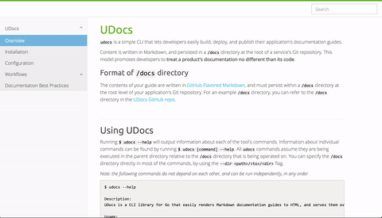

UDocs [](https://travis-ci.org/gdscheele/udocs)
===

`udocs` is a Go CLI that lets developers easily build, deploy, and publish their app's documentation
guide. Documentation content is written in Markdown, and persisted in a `docs/` directory at the root of your project's Git repository.
From there, `udocs` can render the guide's content to HTML, and optionally serve it locally over HTTP for viewing, or send it to a remote UDocs instance for hosting.



---

## Features

- Easy-to-use CLI
- Fast Markdown to HTML rendering 
- Cross-document search (powered by [bleve](https://github.com/blevesearch/bleve))
- Live-reloading of UDocs server when making local document changes 
- MongoDB compatible 
- Single binary
- Quip document support (beta)
- Customizable primary color

--- 

## Installation

> GitHub releases are coming soon.

### Requirements

- Go 1.7+
- Linux or OS X operating systems

### Clone and build from source

```bash
$ go get -u github.com/seanawilliams/udocs
```

---

## Usage

```
$ udocs --help                                                                                                                 

Description:
  UDocs is a CLI library for Go that easily renders Markdown documentation guides to HTML, and serves them over HTTP.

Usage:
  udocs [command]

Available Commands:
  build       Build a docs directory
  destroy     Destroy a docs directory from a remote UDocs server
  env         Show UDocs local environment information
  publish     Publish docs to a remote UDocs host
  serve       Renders docs directories, and serves them locally over HTTP
  tar         Tar a docs directory
  validate    Validate a docs directory
  version     Show UDocs version

Use "udocs [command] --help" for more information about a command.
```

## Configuration 

> More detailed notes are on the way...

`udocs` is configurable via the following environment varibles: 

- `UDOCS_ENTRY_POINT`
- `UDOCS_PORT`
- `UDOCS_BIND_ADDR`
- `UDOCS_EMAIL`
- `UDOCS_ROOT_ROUTE`
- `UDOCS_ROUTES`
- `UDOCS_ORGANIZATION`
- `UDOCS_SEARCH_PLACEHOLDER`
- `UDOCS_MONGO_URL`
- `UDOCS_QUIP_ACCESS_TOKEN`
- `UDOCS_PRIMARY_COLOR`

Executing `udocs env` will output the state of your current, local environment.

## Vendored Dependencies

- https://github.com/blevesearch/bleve (Apache)
- https://github.com/dimfeld/httptreemux (MIT)
- https://github.com/mholt/archiver (MIT)
- https://github.com/shurcooL/github_flavored_markdown (MIT)
- https://github.com/spf13/cobra (Apache)
- https://github.com/fsnotify/fsnotify/tree/v1.4.1 (BSD-3-Clause)
- https://github.com/GeertJohan/go.rice (BSD-2-Clause)
- https://gopkg.in/mgo.v2 (BSD-2-Clause)
- http://fontawesome.io (http://fontawesome.io/license/)
- http://getbootstrap.com (MIT)
