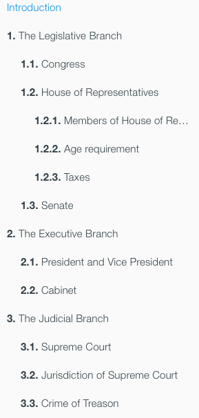

UDocs [](https://travis-ci.org/UltimateSoftware/udocs)
===

`udocs` is a simple CLI that lets developers easily build, deploy, and publish their application's documentation
guides.

Content is written in Markdown, and persisted in a `/docs` directory at the root of a service's Git repository.
This model promotes developers to **treat a product's documentation no different than its code**.

### Format of `/docs` directory
The contents of your guide are written in [GitHub Flavored Markdown](https://help.github.com/articles/github-flavored-markdown/),
and must persist within a `/docs` directory at the root level of your application's Git repository.
For an example `/docs` directory, you can refer to the `/docs` directory in the
[UDocs GitHub repo](https://github.com/ultimatesoftware/udocs).

<br>
<hr>
## Using UDocs
Running `$ udocs --help` will output information about each of the tool's commands. Information about individual commands can be found by running `$ udocs [command] --help`.
All `udocs` commands assume they are being executed in the parent directory relative to the `/docs` directory that is being operated on. You can specify the `/docs` directory directly in most of the commands, by using the `--dir <path>/<to>/<dir>` flag.

*Note: the following commands do not depend on each other, and can be run independently, in any order*

```
$ udocs --help

Description:
UDocs is a CLI library for Go that easily renders Markdown documentation guides to HTML, and serves them over HTTP.

Usage:
udocs [command]

Available Commands:
build       Build a docs directory
destroy     Destroy a docs directory from a remote UDocs server
env         Show UDocs local environment information
publish     Publish docs to a remote UDocs host
pull        Pull docs from remote Git repository
serve       Renders docs directories, and serves them locally over HTTP
tar         Tar a docs directory
validate    Validate a docs directory
version     Show UDocs version

Use "udocs [command] --help" for more information about a command.
```

<br>
<hr>
## Creating content
### Required Files
In order for your guide to properly render into HTML, you will first need to create the following **required** files within
the root of your `/docs` directory:

* `README.md` serves as the landing page of your guide. The first line of this file should be:
    ```
    # <My Application>
    ```
   where `<My Application>` is replaced with the actual name of your application.

* `SUMMARY.md` defines the sidebar table of contents for your guide, as well as the sub-route at which the docs guide would be served at. The summary file should start out with:

    ```
    # <My UCloud Managed Service>
    ```
   For each chapter (and sub-chapter) in the guide, add an entry like so:

        * [<My Chapter>](<path/to/content.md>)

    where `<My Chapter>` is the name of the chapter as it will appear in the table of contents sidebar, and `<path/to/content.md>`
    is the `/docs` relative path to the Markdown file that this chapter refers to.
    To add sub-chapters under a chapter entry in your `docs/SUMMARY.md` file, indent the line of your sub-chapter entry using **tabs (4 spaces)**.
    You can indent further to get up to 2 additional layers of sub-chapters if desired.

    The following is an example `docs/SUMMARY.md` file:

        # Branches of US Government
        * [Overview](README.md)
        * [The Legislative Branch](legislative/README.md)
            * [Congress](legislative/congress.md)
            * [House of Representatives](legislative/house.md)
                * [Members of House of Representatives](legislative/housemembers.md)
                * [Age requirement](legislative/age.md)
                * [Taxes](legislative/taxes.md)
            * [Senate](legislative/senate.md)
        * [The Executive Branch](executive/README.md)
            * [President and Vice President](executive/president.md)
            * [Cabinet](executive/cabinet.md)
        * [The Judicial Branch](judicial/README.md)
            * [Supreme Court](judicial/supremecourt.md)
            * [Jurisdiction of Supreme Court](judicial/jurisdiction.md)
            * [Crime of Treason](judicial/treason.md)

    You may notice the pattern of giving each chapter its own `README.md` file within the designated directory of that chapter's
    contents. This is not required, but is generally considered a good practice as it promotes consistent organization of your
    documentation guide.

    The above `docs/SUMMARY.md` file would be rendered in your guide's navigation sidebar as shown below:

    

    The aforementioned content would have the following directory structure within your service's Git repository:

    ```
    +-- my-ucloud-managed-service
        +-- src
        +-- docs
        |   +-- README.md
        |   +-- SUMMARY.md
        |   +-- legislative
        |   |   +-- README.md
        |   |   +-- congress.md
        |   |   +-- house.md
        |   |   +-- housemembers.md
        |   |   +-- age.md
        |   |   +-- taxes.md
        |   |   +-- senate.md
        |   +-- executive
        |   |   +-- README.md
        |   |   +-- president.md
        |   |   +-- cabinet.md
        |   +-- judicial
        |   |   +-- README.md
        |   |   +-- supremecourt.md
        |   |   +-- jurisdiction.md
        |   |   +-- treason.md
        +-- bin
    ```

<br>

### Markdown Syntax

Each of the pages of the guide should be written in Markdown, specifically [GitHub Flavored Markdown](https://help.github.com/articles/github-flavored-markdown/).
